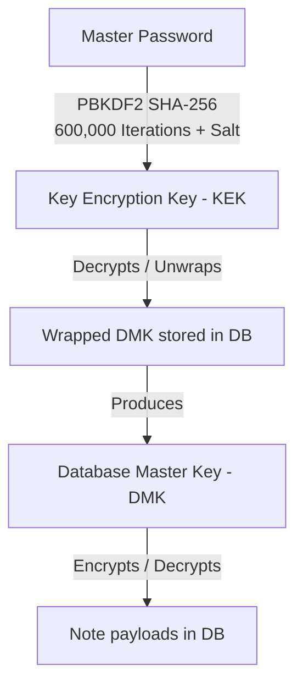

# Noten

[](https://opensource.org/licenses/Apache-2.0)
[](#key-features)
[](#sync-setup-filen)

**Noten** is a fast, lightweight, and end-to-end encrypted (E2E) notes application. Designed with a **local-first** architecture, it runs entirely in your browser, works 100% offline, and replicates securely to your personal Filen account.

Because the encryption is client-side, the sync server only stores ciphertext. **Your password and notes are never exposed in plaintext to any network or server.**

---

## Key Features

- **Masonry Grid Layout**: Responsive, native CSS masonry grid for note cards, color-coded categorizations, pinning/unpinning, and tag badges.
- **Client-Side Cryptography**: Zero-knowledge E2E encryption using browser-native **Web Crypto API** (AES-GCM 256-bit & PBKDF2).
- **Offline PWA Support**: Pre-cached static files via Service Worker. The app loads instantly even with zero network connection.
- **Bi-directional Sync**: Seamless background synchronization to **Filen** cloud storage with local PouchDB caching and automatic conflict resolution.
- **Backup & Import**: Export encrypted raw database files, export decrypted notes in JSON format, or restore from external backups.
- **Modern Bundling**: Compiled using Vite with node polyfills to bundle the Filen SDK directly for browser environment.

---

## Cryptographic Security Model

Noten implements standard **Envelope Encryption** to ensure that notes can be decrypted quickly while allowing password modifications without re-encrypting the entire database.



1. **Key Derivation (KDF)**:
   - When a password is set, a random 16-byte salt is generated.
   - A **Key Encryption Key (KEK)** is derived via **PBKDF2** using `SHA-256` hashing and `600,000` iterations.
2. **Envelope Encryption**:
   - The app generates a random 256-bit **Database Master Key (DMK)**.
   - The DMK is wrapped (encrypted) using **AES-GCM (256-bit)** with the KEK and stored in PouchDB.
   - Notes are serialized as JSON strings `{ title, body, tags, color, isPinned, isArchived, isTrashed, createdAt, updatedAt }` and encrypted with the DMK using a unique 12-byte initialization vector (IV) per note.
3. **Password Changes**:
   - Because of envelope encryption, changing your password only requires decrypting the DMK with the old KEK, and re-encrypting it with a new KEK derived from the new password. The individual notes themselves do not need to be re-encrypted.

> [!WARNING]
> **Zero-Knowledge Security Alert**: There is no password recovery server. If you lose your master password, your notes are permanently lost. It is highly recommended to export an encrypted backup file from the Settings panel for safety.

---

## Getting Started

### Prerequisites
You need Node.js and npm installed to run and build this project.

### Running Locally
To run the app locally, clone this repository, install the dependencies, and start the Vite dev server:

```bash
# Clone the repository
git clone https://github.com/FrancoFantomius/Notes.git
cd Notes

# Install dependencies
npm install

# Start development server
npm run dev
```
Simply open the local URL printed in your console (usually `http://localhost:3000`) in your web browser.

*Note: The Web Crypto API requires a secure context. The app will only initialize on `localhost` or via `https://` URLs.*

### Building for Production
To bundle and build the static distribution folder `dist`:

```bash
npm run build
```

---

## Sync Setup (Filen)

You can synchronize your notes across multiple devices (desktops, phones, tablets) by connecting them to your personal Filen account. 

### 1. Enabling Sync in the App
1. Open the app and navigate to **Settings** (gear icon in the top right).
2. Enter your **Filen Email** and **Password** (and Two-Factor Code if enabled on your account).
3. Click **Save & Enable Sync**. The app will upload your encrypted verification metadata to Filen and start background replication.

### 2. Syncing to a New Device
1. Open the Noten app on your new device.
2. On the lockscreen, click **Restore from a remote sync server**.
3. Enter your **Filen Email**, **Password**, and **Two-Factor Code** (if applicable).
4. Click **Connect & Retrieve Key**. The app will securely fetch your encrypted master key verification metadata from Filen.
5. Enter your existing **Master Password** to derive the keys, unlock the vault, and download your notes automatically.

---

## Tech Stack

- **Markup & Layout**: Semantic HTML5
- **Styling**: Vanilla CSS3 (Custom Variables, Column Masonry Layouts, responsive media queries)
- **Local Storage**: IndexedDB (managed via PouchDB)
- **Encryption Engine**: Native Web Crypto API
- **Cloud Replication**: Filen SDK Integration
- **Bundler**: Vite & Vite Node Polyfills Plugin
- **Icons**: Lucide Icons CDN

---

## License

This project is licensed under the Apache License, Version 2.0. See the [LICENSE](LICENSE) file for the full license text.