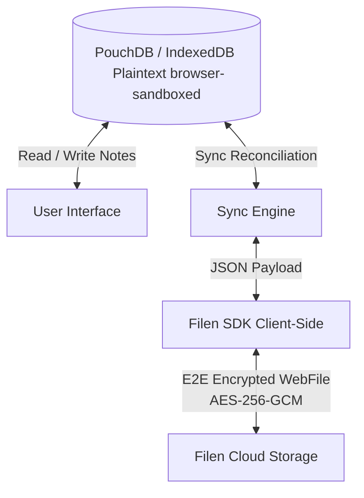

# Noten

[](https://github.com/FrancoFantomius/noten/releases)
[](https://www.gnu.org/licenses/agpl-3.0)
[](#key-features)
[](#sync-setup-filen)

**Noten** is a fast, lightweight, and end-to-end encrypted (E2E) notes application. Designed with a **local-first** architecture, it runs entirely in your browser, works 100% offline, and replicates securely to your personal Filen account.

Because the encryption is client-side, the sync server only stores ciphertext. **Your credentials and note contents are never exposed in plaintext to any network or cloud server.**

---

## Key Features

- **Local-First & Offline Support**: Stores notes locally in IndexedDB (via PouchDB) for instantaneous loading. The application is a fully functional Progressive Web App (PWA) with offline capabilities.
- **Client-Side E2E Encrypted Sync**: Seamless synchronization with your personal **Filen** account using the official Filen SDK. All encryption and decryption happen in your browser using AES-256-GCM before data is uploaded.
- **Material Design 3 Components**: Fully native Material Design 3 interface powered by `@francofantomius/material-components` and Lit, offering accessible, high-performance web components.
- **Account Storage Breakdown**: Interactive account menu with visual indicators for total Filen storage usage (notes vs. other files vs. available space).
- **App Drawer Ecosystem**: Integrated app switcher drawer for seamless navigation across companion web applications.
- **Advanced Interactive Checklists**:
  - Toggle checklist format on notes.
  - **Hierarchical Tasks**: Indent checklist items using `Tab` (or `Shift + Tab` to outdent) or the on-screen left/right chevron buttons.
  - **Drag-and-Drop Reordering**: Move tasks with cursor dragging, or use keyboard shortcuts `Alt + Arrow Up` / `Alt + Arrow Down`.
- **Responsive Masonry Layout**: Beautifully displays notes in a CSS-column masonry grid. Pin crucial notes to the top of your feed.
- **Organization & Customization**:
  - Color-code note cards using curated premium palettes.
  - Categorize notes with custom hashtags (`#tags`).
  - Search bar with integrated tag filter chips.
  - Dynamic Tag Section in the sidebar for quick filtering.
  - Real-time instant search across titles, descriptions, and tags.
- **Media Attachments**:
  - Attach multiple images to note cards.
  - Local image compression via the Canvas API (JPEG at 75% quality) to optimize sync speeds.
  - Grid preview layouts on note cards and a fullscreen image lightbox viewer.
- **Workflow Archiving & Trash**:
  - Move completed or old notes to the **Archive** to keep your feed clean.
  - Send notes to **Trash** with options to restore or delete them permanently.
- **Multi-language Support (i18n)**: Fully translated into 16 languages — Arabic (العربية), Chinese (中文), Dutch (Nederlands), English, French (Français), German (Deutsch), Greek (Ελληνικά), Hindi (हिन्दी), Italian (Italiano), Polish (Polski), Portuguese (Português), Russian (Русский), Spanish (Español), Swedish (Svenska), Turkish (Türkçe), and Ukrainian (Українська) — with dynamic runtime switching and automatic browser-language detection.
- **Theme Modes**: Light, Dark, and Device (system) theme switching.
- **Privacy-Focused & Self-Hosted Assets**: Self-hosted Roboto font and an automatically generated Material Symbols dynamic icon subset for zero-CDN tracking and maximum offline performance.
- **Data Portability**: Prevent platform lock-in by exporting database contents to a JSON file or importing backups to restore them.

---

## Cryptographic Security Model

In this version of Noten, client-side encryption and cloud storage are offloaded directly to the secure, zero-knowledge cloud provider **Filen** via the battle-tested official **Filen SDK**.



### 1. Local Security (Browser Sandboxing)
Local notes are stored in plaintext within the browser's IndexedDB (managed by PouchDB) under the database name `noten_db`. Local access is protected by the browser's native sandboxing mechanisms:
- **Same-Origin Policy (SOP)**: Restricts other websites from accessing your IndexedDB cache.
- **Sandboxed Scope**: Data remains local and private to the device. Note: For shared devices, clearing site storage or using guest profiles is recommended.

### 2. Client-Side E2E Encryption (Syncing)
When you log in to Filen and enable Sync, encryption operations are performed client-side in the browser:
- **Zero-Knowledge Key Derivation**: Encryption keys are derived client-side from your Filen password. Filen servers never receive or store your plaintext password.
- **AES-256-GCM Encryption**: Note data payloads are serialized into JSON, wrapped as blobs, and encrypted via the Filen SDK client library using AES-256-GCM before transmission.
- **Storage**: Filen only stores encrypted ciphertext metadata and file chunks. Plaintext notes are never exposed to any network or server.

---

## Getting Started

### Prerequisites
You need Node.js and npm installed to run and build this project.

### Running Locally
To run the app locally, clone this repository, install the dependencies, and start the Vite dev server:

```bash
# Clone the repository
git clone https://github.com/FrancoFantomius/noten.git
cd noten

# Install dependencies
npm install

# Start development server
npm run dev
```
Open the local URL printed in your console (usually `http://localhost:5173` or similar) in your browser.

*Note: The Web Crypto API and secure features require a secure context (HTTPS) to function in production, but work on `localhost` during development.*

### Building for Production
To compile and build the static distribution folder `dist`:

```bash
npm run build
```

---

## Sync Setup (Filen)

You can synchronize your notes across multiple devices (desktops, phones, tablets) by connecting them to your personal Filen account.

### 1. Enabling Sync in the App
1. Open the app and navigate to **Settings** (gear icon in the top right).
2. Enter your **Filen Email** and **Password** (and Two-Factor Code if enabled on your account).
3. Click **Save & Enable Sync**. The app will connect to your account and upload notes to the secure directory `/Apps/Noten/notes/`.

### 2. Syncing to a New Device
1. Open the Noten app on your new device.
2. Go to **Settings** and log in using your **Filen Email**, **Password**, and **Two-Factor Code**.
3. The background sync process will automatically fetch the encrypted notes from `/Apps/Noten/notes/`, decrypt them locally using the SDK, and populate your local PouchDB instance.

## Project Structure

```text
├── archive.html         # Archive page view shell
├── index.html           # Main dashboard view shell
├── trash.html           # Trash bin view shell
├── terms.html           # Terms of Service static page
├── privacy.html         # Privacy Policy static page
├── templates/           # Shared Handlebars HTML template partials
│   ├── head.html        # App head meta, fonts setup
│   ├── header.html      # Main app navigation header & profile dropdown
│   ├── sidebar.html     # Sidebar navigation menu
│   ├── note-creator.html# Note creator component
│   ├── notes-grid.html  # Pinned/unpinned note grid container
│   ├── note-modal.html   # Note editor modal overlay
│   ├── settings-modal.html# Settings & sync configuration modal
│   ├── login-modal.html # Filen sync login modal
│   ├── lightbox.html    # Fullscreen image viewer modal
│   ├── fab.html         # Mobile floating action button
│   └── head-static.html # Head boilerplate for static pages
├── vite.config.js       # Vite configuration
├── package.json         # Node dependencies and scripts
├── sw.js                # Service Worker for offline PWA support
├── manifest.json        # PWA manifest configurations
├── css/                 # Application styles
│   ├── variables.css    # CSS Variables (colors, fonts, sizes)
│   ├── reset.css        # Basic reset stylesheet
│   ├── layout.css       # Layout grids, sidebar, and container styles
│   ├── notes.css        # Note grids and specific note card layouts
│   ├── components.css   # Reusable UI elements (FAB, buttons, notifications)
│   ├── lockscreen.css   # Lockscreen and pin entry UI styles
│   ├── account.css      # User profile and account manager styling
│   ├── static.css       # Static pages styling (terms, privacy)
│   └── style.css        # Entrypoint importing all CSS modules
├── img/                 # Logos and PWA icons
└── js/                  # Application logic and scripts
    ├── app.js           # Core application flow and routing initialization
    ├── db.js            # PouchDB local database adapter and Filen E2E sync integration
    ├── ui.js            # General DOM manipulations, event listeners, and routing logic
    ├── i18n.js          # Internationalization module
    ├── languages/       # Translation JSON dictionaries (ar, de, el, en, es, fr, hi, it, nl, pl, pt, ru, sv, tr, uk, zh)
    └── ui/              # Component-specific UI scripts
        ├── state.js     # Shared application state
        ├── account.js   # Account dropdown, settings & login modal controls
        ├── cards.js     # Note card generation, rendering, and interactions
        ├── creator.js   # Note creation, editing modal trigger, and checklist handling
        ├── checklist.js # Checklist drag-and-drop & indentation logic
        ├── modal.js     # Settings modal, import/export controls, and modals
        ├── theme.js     # Light/dark mode switching and sync logic
        └── utils.js     # Shared helper utilities (date formatting, debouncers, etc.)
```

---

## Tech Stack

- **UI Components**: Material Design 3 Web Components (`@francofantomius/material-components`, `lit`)
- **Markup & Layout**: Semantic HTML5 with Handlebars partial templates (`vite-plugin-handlebars`)
- **Styling**: Material Design 3 & Vanilla CSS3 (Custom Variables, Column Masonry Layouts, responsive media queries)
- **Local Storage**: IndexedDB (managed via PouchDB 9)
- **Replication & E2E Encryption**: Filen SDK Integration (`@filen/sdk`)
- **Bundler**: Vite & Vite Node Polyfills Plugin
- **Fonts & Icons**: Self-hosted Roboto (`@fontsource/roboto`) & Material Symbols Outlined dynamic subset (`@fontsource-variable/material-symbols-outlined`, `subset-font`)

---

## Contributing

Contributions are welcome! Please read [CONTRIBUTING.md](CONTRIBUTING.md) for details on our code of conduct, development setup, template architecture, and pull request process.

See the [CHANGELOG.md](CHANGELOG.md) for a detailed history of releases and changes.

---

## License

This project is licensed under the GNU Affero General Public License v3 (AGPL-3.0). See the [LICENSE](LICENSE) file for the full license text.
